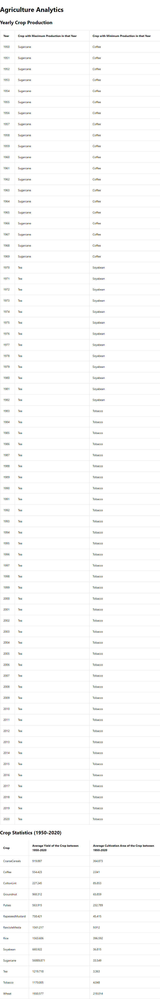

# Agriculture Analytics

This project performs data analytics on the Indian Agriculture dataset and displays the results in tables using React and Mantine.

## Overview

The application performs the following tasks:
1. Aggregates crop data to display the crop with maximum and minimum production for each year.
2. Calculates and displays the average yield and average cultivation area for each crop from 1950 to 2020.

## Technologies Used

- **React**: A JavaScript library for building user interfaces.
- **TypeScript**: A strongly typed programming language that builds on JavaScript.
- **Mantine**: A React component library used for creating tables and other UI components.
- **Yarn**: A package manager for JavaScript.

## How to Run

1. **Clone the repository**:
   ```bash
   git clone https://github.com/kk7188048/Data-analysis-task.git
   cd agriculture-analytics


### `yarn start`

Runs the app in the development mode.\
Open [http://localhost:3000](http://localhost:3000) to view it in the browser.

The page will reload if you make edits.\
You will also see any lint errors in the console.

## Screenshots

### Yearly Crop Production Table && Crop Statistics Table



### `yarn build`

Builds the app for production to the `build` folder.\
It correctly bundles React in production mode and optimizes the build for the best performance.

The build is minified and the filenames include the hashes.\
Your app is ready to be deployed!

See the section about [deployment](https://facebook.github.io/create-react-app/docs/deployment) for more information.


## Learn More

You can learn more in the [Create React App documentation](https://facebook.github.io/create-react-app/docs/getting-started).

To learn React, check out the [React documentation](https://reactjs.org/).

